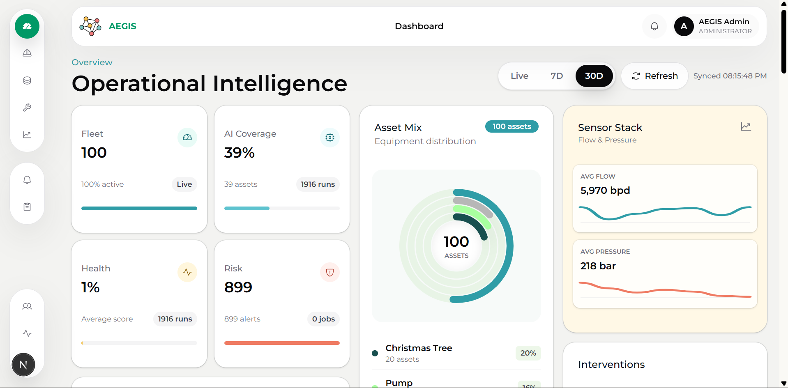

# AEGIS

AEGIS is a predictive maintenance command centre for upstream oil and gas operations. It brings equipment records, operational readings, model inference, risk alerts, maintenance planning, reporting and audit activity into one controlled workspace for reliability teams.

The product is designed for teams that need a clearer view of asset health before failures become operational interruptions. AEGIS converts telemetry and maintenance context into health scores, failure probability, risk levels and explainable maintenance recommendations.

## What AEGIS Helps Teams Do

- Monitor production equipment across fleet, category, location, status and maintenance exposure.
- Capture operational readings that describe asset condition, load, temperature, vibration, pressure, flow and wear signals.
- Run predictive scoring against stored readings to estimate failure probability and equipment health.
- Prioritise risk through active alerts, severity queues and structured response states.
- Plan and review maintenance work using status, due dates and service history.
- Export operational, maintenance, prediction and alert records for reporting workflows.
- Review account, entity and system activity through an administrative audit trail.

## Product Modules

### Overview
A fleet-level operational intelligence dashboard showing asset count, prediction coverage, average health, current risk load, asset mix, sensor summaries, maintenance plans and recent activity.

### Equipment
A register for production assets with category, location, operating status, latest health, latest risk and maintenance exposure. Each asset profile links readings, predictions, maintenance history and lifecycle actions.

### Operational Data
A telemetry workspace for recording and reviewing model inputs. Recent readings can be searched, filtered by recorded date range and narrowed by equipment category.

### Predictive Analytics
An inference workspace that scores readings, tracks job state, visualises failure and health trends, and stores the latest prediction outputs with recommendations.

### Alerts
A response queue for prediction-led risk events. Alerts can be acknowledged, resolved and reviewed with the full risk message separated from the table view for clearer triage.

### Maintenance
A service history and planning area for recording maintenance actions, tracking work state and seeing what is overdue, due soon or completed.

### Reports
A structured reporting area for equipment, maintenance, prediction and alert exports.

### Users and Audit
Administrative controls for authorised accounts, role/status management, account removal and redacted activity review.

## Decision Support

AEGIS presents model output as practical maintenance context rather than isolated scores. Predictions include:

- Failure probability.
- Equipment health score.
- Risk level.
- Relevant operational parameters.
- Human-readable reason and recommendation.

The system is intended to support maintenance prioritisation, inspection planning and operational review. It does not replace engineering judgement, statutory inspection requirements or site safety procedures.

## Access Model

AEGIS uses role-based access so operators, maintenance engineers, operations managers and administrators see the workflows appropriate to their responsibilities. Administrative actions and system-generated events are written to the audit trail for accountability.
